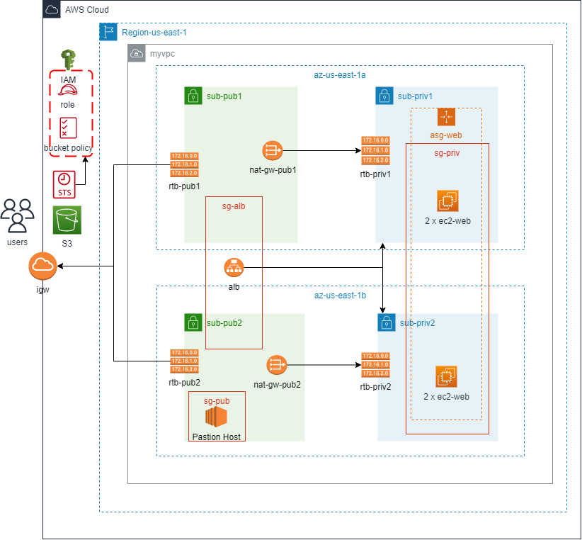

# Deploy a High-Availability Web App using CloudFormation 



> In this project (App), I deployed web servers for a highly available web app using CloudFormation.
> I wrote the script that creates and deploys the infrastructure and application for an app from the ground up.
> The script begin deploying the networking components followed by servers, security roles and software.

## The files included are:
```sh
* /Images-of-result-deploy : Screenshot the result of deploy.
* /App : App Code
* create.sh : Cloudformation create stack script. 
* update.sh : Cloudformation update stack script.
* destroy.sh : Cloudformation delete stack script.
* networkandserver.yml :  Project's CloudFormation script.
* networkandserver.json :  Project's CloudFormation script parameters.
```
## Instruction of deploy CloudFormation:

Just run;
```sh
> ./create.sh myWebApp networkandserver.yml networkandserver.json
```

## Instruction of deploy:

1. [AWS CLI] Create S3 bucket with name myapp-6291-7066-6893-demo

aws s3api create-bucket --bucket bucket-name --region us-east-1

aws s3api create-bucket --bucket myapp-6291-7066-6893-demo --region us-east-1

2. [AWS CLI] Upload myApp.zip includes data of {index.html , me.jbg}

aws s3 cp .\myApp.zip s3://myapp-6291-7066-6893-demo/

3. [Manually] Create keypair "myAppNVirginiaEC2KP.pem" to be used in EC2Web instances in CF template && "jumbbox-key.pem" for Bastion Host

4. Run CF template

aws cloudformation create-stack  --stack-name myWebApp --region us-east-1 --template-body file://networkandserver.yml --parameters file://networkandserver.json --capabilities "CAPABILITY_IAM" "CAPABILITY_NAMED_IAM"
 
aws cloudformation update-stack  --stack-name myWebApp --region us-east-1 --template-body file://networkandserver.yml --parameters file://networkandserver.json --capabilities "CAPABILITY_IAM" "CAPABILITY_NAMED_IAM" 

aws cloudformation delete-stack  --stack-name myWebApp --region us-east-1  

5. [Manually] Create Bastion Host in a public subnet.
	ServerSpecs:
		Amazon Linux 2 AMI (HVM), SSD Volume Type
		t2.micro
		myAppVPC
		publicsubnet
		Auto Assign public IP
	Storage:
		8 GB
	Tags:
		Name=JumbBox
	SG:
		Name=JumbBox-SG
		Inbound Rules= Allow SSH on port 22, Source=MY IP, Description=Administrator Access
	Keypair:
		jumbbox-key.pem
		
6. Connect to jumbbox and verify connection to EC2 instances

ssh -i "jumbbox-key.pem" ec2-user@<JumbBox PublicIP>  #just to check ssh connection

scp -i "jumbbox-key.pem" myAppNVirginiaEC2KP.pem ec2-uer@<JumbBox PublicIP>:/home/ec2-user/myAppNVirginiaEC2KP.pem   #copy from host machine to jumbbox server

ssh -i "jumbbox-key.pem" ec2-user@<JumbBox PublicIP>

Just run the below to validate and change permissions on EC2-PrivateIP;
```sh
   ls
   chmod 400 myAppNVirginiaEC2KP.pem
   ssh -i "myAppNVirginiaEC2KP.pem" ubuntu@<EC2-PrivateIP>
```
## Instruction of deleting S3 bucket:
aws s3 rm s3://bucket-name --recursive
aws s3 rm s3://myapp-6291-7066-6893-demo --recursive

aws s3api delete-bucket --bucket bucket-name --region us-east-1
aws s3api delete-bucket --bucket myapp-6291-7066-6893-demo --region us-east-1